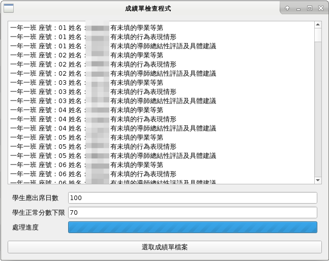
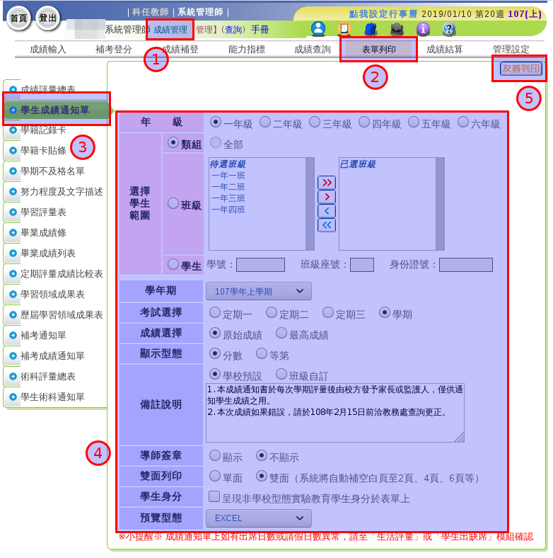

執行畫面
========

匯出成績檔案設定畫面
====================

請依照下圖截圖將檔案匯出，才能讓檢查程式完成相關檢查。

環境需求
========

1. Python 3.5+

安裝
====

Windows 環境注意事項
--------------------

請務必安裝 Visual Studio 2015 的 Visual C++ 可轉散發套件。

安裝 PySide2
------------

指令如下::
    
    pip install PySide2

執行
====

::

    cd transcript_checker
    python transcript.py

